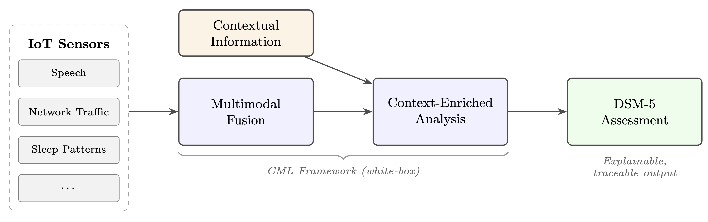
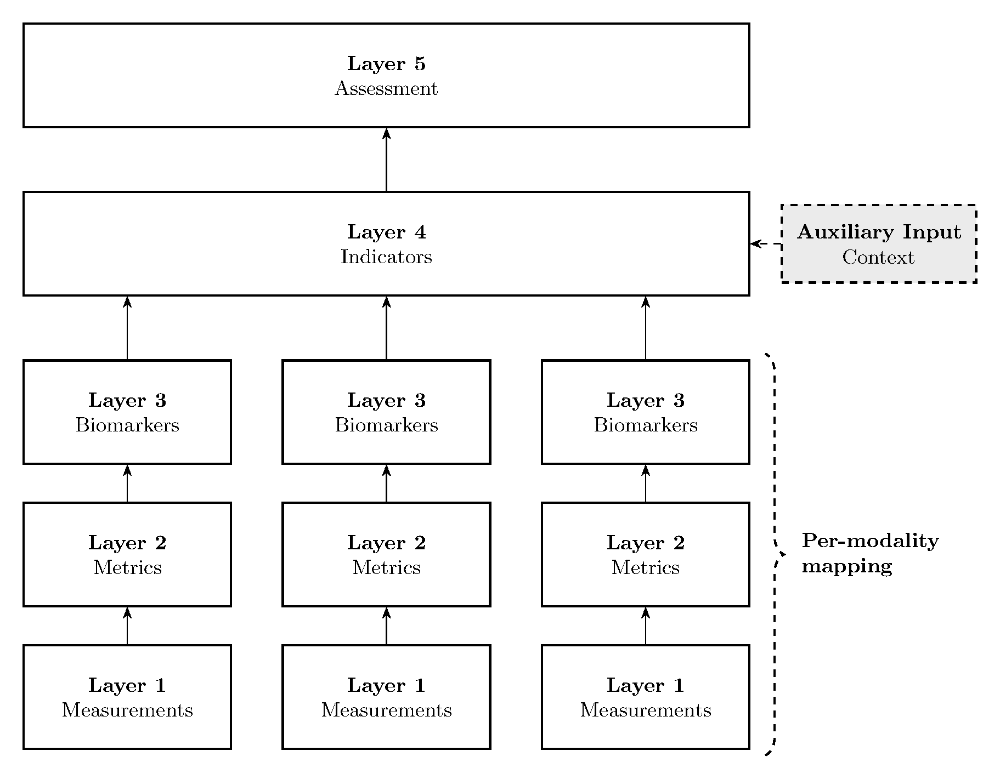
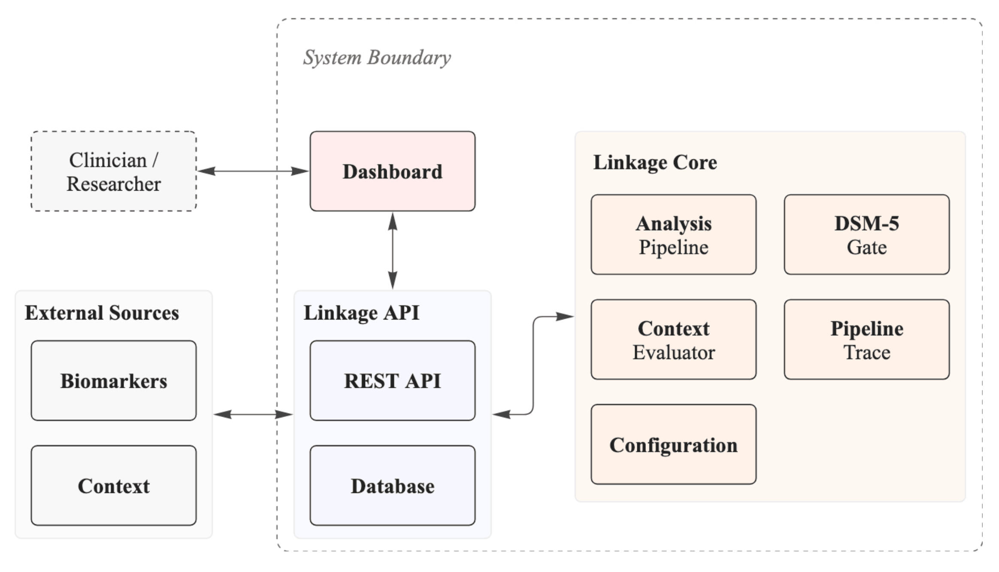

# Explainable Multimodal-based Depression Awareness at the Edge

> This repository contains the proof-of-concept implementation developed for the master's thesis
> *Explainable Multimodal-based Depression Awareness at the Edge* in Computer Science at the
> [University of St. Gallen (HSG)](https://www.unisg.ch/en/).



https://github.com/user-attachments/assets/42d36ff8-c322-431b-a715-68bd7fd87a63

## Motivation

Major depressive disorder affects approximately 236 million people worldwide and is a leading cause
of disability. Despite its prevalence, reliable early detection remains difficult: traditional diagnostic
methods depend on episodic clinical encounters and subjective self-report, and fail to capture the
continuous, fluctuating nature of symptoms as they manifest in everyday home environments.

Recent advances in passive sensing and digital phenotyping have opened promising avenues for
continuous, unobtrusive monitoring. However, the majority of actively researched systems rely on
black-box machine learning models whose internal reasoning is opaque to clinicians and patients.
In clinical settings, where decisions carry significant consequences, such opacity undermines trust and
hinders adoption.

Prior work by [Länzlinger](https://github.com/jonaslanzlinger/depression-detection)
introduced the *Linkage Framework*, a white-box approach that transparently
maps sensor observations to established DSM-5 diagnostic criteria — but for a single data modality in
isolation and without accounting for the environmental context at the time of data collection. Bridging
this gap — fusing heterogeneous sensor streams and incorporating contextual information within an
explainable framework — forms the motivation for this thesis.

## Artifact

This repository is the proof-of-concept implementation of two conceptual contributions proposed by
the thesis.

**CML Framework** — The *Contextual Multimodal Linkage (CML) Framework* extends the original
Linkage Framework with two structural additions. First, a late-fusion multimodal architecture that
replicates the measurement-to-biomarker processing path for each sensor modality independently and
converges per-modality biomarkers into shared indicator scores at the indicator boundary, preserving
per-modality explainability throughout. Second, a context-as-modifier model that treats environmental
information (e.g., ambient noise, number of people present, network activity) as an active weight modifier
during indicator aggregation, enabling the same sensor reading to be interpreted differently depending
on the situational context in which it was collected. The two extensions operate orthogonally and
compose naturally when both are active.



**System Architecture** — The proposed architecture operationalises the CML Framework into a
deployable, end-to-end pipeline. It is structured as a modular system with four components: a
FastAPI backend that exposes a data ingestion and retrieval API for external sensor sources, a Python
analysis core that executes the full CML pipeline (biomarker processing, context evaluation, indicator
computation, and DSM-5 gating), a Streamlit dashboard for interactive visualization and analysis
control, and a PostgreSQL database for persistent storage. The architecture supports full pipeline
reproducibility via configuration snapshots stored alongside each analysis run, and was validated for
feasibility of execution on low-cost edge hardware without cloud dependencies.



## Repository Overview

| Directory | Role in Pipeline |
|---|---|
| `src/api/` | FastAPI application — data ingestion and retrieval endpoints for external sensor sources |
| `src/core/` | Analysis engine — implements all six pipeline stages of the CML Framework |
| `src/dashboard/` | Streamlit dashboard — pipeline visualisation, scenario exploration, and analysis control |
| `src/shared/` | Shared database models, configuration loading, and logging utilities |
| `config/` | YAML-driven configuration files that govern indicator definitions, DSM-5 gate thresholds, EMA parameters, context weights, and user baselines |
| `config/mock_data/` | Config-driven mock data generator definitions and scenario presets |
| `config/baselines/` | Population-level baseline definitions used when no user-specific baseline is available |
| `tests/` | Pytest test suite mirroring the `src/` structure; covers API, core, dashboard, and shared layers |

## Services Overview

| Service | Container | Port | URL |
|---|---|---|---|
| FastAPI (ingestion & retrieval) | `mt_poc_api` | 8000 | http://localhost:8000/docs |
| Streamlit Dashboard | `mt_poc_dashboard` | 8501 | http://localhost:8501 |
| PostgreSQL | `mt_poc_postgres` | 5432 | internal |
| pgAdmin | `mt_poc_pgadmin` | 5050 | http://localhost:5050 |

## Quick Start

#### 1. Configure environment

```bash
cp .env.example .env
```

#### 2. Build and start all services

```bash
docker-compose up --build
```

#### 3. Use the dashboard

Open the Streamlit dashboard at http://localhost:8501. The dashboard provides five views:

- **Analysis** — trigger an analysis run and inspect per-step pipeline traces, indicator timelines, and the DSM-5 assessment gate
- **Context** — review context evaluation history and how environmental factors modified each analysis run
- **Experiment** — adjust configuration parameters and compare results across runs
- **Generate Mock Data** — generate simulated sensor data directly from the UI (wraps the CLI generator)
- **Data** — browse raw biomarker and context marker records stored in the database

## Configuration

The analysis pipeline is fully governed by YAML files in `config/`. This is the primary mechanism
through which the white-box explainability property of the CML Framework is realised in practice —
all thresholds, weights, and membership functions are visible, auditable, and adjustable without code
changes.

| File | Governs |
|---|---|
| `indicators.yaml` | Indicator definitions — which biomarkers contribute to which DSM-5-aligned indicators, and how |
| `dsm_gate.yaml` | DSM-5 criterion thresholds — minimum indicator scores required to trigger criterion flags |
| `ema.yaml` | Exponential moving average parameters for temporal smoothing per biomarker |
| `context_weights.yaml` | Context weight modifiers — how environmental factors adjust biomarker contributions |
| `context_evaluation.yaml` | Context evaluation rules — fuzzy membership functions for context markers |
| `episode.yaml` | Episode detection parameters — duration and persistence thresholds |
| `reliability.yaml` | Data reliability and dropout handling parameters |
| `baselines/` | Population and user-level baseline definitions for membership computation |

## Development

### Prerequisites

- Python 3.11
- Docker and Docker Compose

### Setup

```bash
python3.11 -m venv venv
source venv/bin/activate

pip install -r requirements.txt
```
